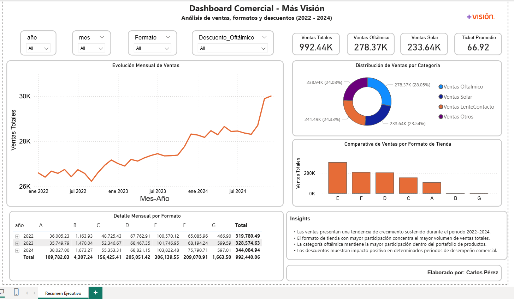

# 📊 Más Visión Sales Forecasting


Proyecto de Ciencia de Datos orientado al análisis estratégico y forecasting de ventas retail mediante técnicas de Machine Learning, series temporales, análisis exploratorio de datos y visualización ejecutiva.

---

# 📑 Tabla de Contenido

- Descripción del Proyecto
- Objetivo del Proyecto
- Problemática de Negocio
- Tecnologías Utilizadas
- Estructura del Proyecto
- Dataset
- Análisis Exploratorio de Datos (EDA)
- Dashboard Ejecutivo
- Modelo Predictivo
- Métricas del Modelo
- Resultados Obtenidos
- Forecast de Ventas 2025
- Habilidades Demostradas
- Riesgos y Oportunidades
- Recomendaciones Estratégicas
- Archivos Relevantes
- Próximos Pasos

---

# 📌 Descripción del Proyecto

La planificación estratégica de ventas en empresas retail requiere modelos predictivos capaces de identificar tendencias, patrones comerciales y comportamiento histórico de las sucursales.

Más Visión enfrentaba el reto de mejorar la precisión en la proyección de ventas mensuales para el año 2025 utilizando información histórica correspondiente al periodo 2022–2024.

El proyecto fue desarrollado con el objetivo de transformar datos comerciales en información estratégica mediante:

- Análisis Exploratorio de Datos (EDA)
- Visualización interactiva en Power BI
- Forecasting con modelos ARIMA
- Predicción de ventas
- Identificación de patrones comerciales
- Generación de insights estratégicos

---

# 🎯 Objetivo del Proyecto

Desarrollar un modelo predictivo de ventas que permita estimar el comportamiento comercial futuro de las sucursales de Más Visión para el año 2025, utilizando datos históricos y técnicas de análisis de series temporales.

---

# 🧠 Problemática de Negocio

La empresa realizaba estimaciones comerciales utilizando criterios generales que no consideraban adecuadamente:

- Patrones históricos de ventas
- Estacionalidad comercial
- Impacto de descuentos
- Variabilidad entre sucursales
- Diferencias entre formatos de tienda

Esto afectaba:
- Planeación financiera
- Gestión de inventario
- Establecimiento de metas comerciales
- Toma de decisiones estratégicas

---

# 🛠️ Tecnologías Utilizadas

| Herramienta | Uso |
|---|---|
| Python | Análisis y modelado |
| Pandas | Limpieza y transformación |
| NumPy | Procesamiento numérico |
| Matplotlib | Visualización |
| Seaborn | Análisis gráfico |
| Statsmodels | Modelo ARIMA |
| Power BI | Dashboard ejecutivo |
| Excel | Gestión de datasets |

---

# 📂 Estructura del Proyecto

```bash
Mas-Vision-Sales-Forecasting
│
├── dashboard/
├── data/
│   ├── raw/
│   ├── processed/
│   └── predictions/
├── images/
├── notebooks/
├── presentation/
└── README.md
```

---

# 📊 Dataset

El proyecto utiliza información histórica de ventas correspondiente al periodo 2022–2024.

## Variables principales
- Año
- Mes
- ID de sucursal
- Formato de tienda
- Ventas totales
- Ventas oftálmicas
- Ventas solares
- Ventas de lentes de contacto
- Ventas adicionales
- Descuentos comerciales

## Cobertura
- Más de 443 sucursales
- Miles de registros históricos
- Información mensual de ventas

---

# 🔎 Análisis Exploratorio de Datos (EDA)

Durante esta etapa se realizaron procesos de:

- Validación de calidad de datos
- Detección de valores nulos
- Limpieza y transformación
- Análisis estadístico
- Identificación de tendencias
- Evaluación de estacionalidad
- Relación entre descuentos y ventas
- Análisis por categorías y formatos comerciales

## Principales hallazgos
- Crecimiento sostenido de ventas entre 2022 y 2024
- El formato E presentó mayor participación comercial
- La categoría oftálmica mostró mayor contribución en ingresos
- Existencia de patrones estacionales relevantes

---

# 📷 Dashboard Ejecutivo

El dashboard interactivo fue desarrollado en Power BI con el objetivo de facilitar el monitoreo comercial y la toma de decisiones estratégicas.

## Funcionalidades principales
- KPIs comerciales
- Tendencias históricas
- Comparativa por formato
- Segmentación por categorías
- Filtros dinámicos
- Visualización de descuentos



---

# 🤖 Modelo Predictivo

Para el forecasting de ventas se implementó un modelo ARIMA orientado al análisis de series temporales.

## Modelo seleccionado

ARIMA (2,1,2)

## Justificación
- Captura tendencias históricas
- Adecuado para forecasting comercial
- Identifica patrones secuenciales
- Permite proyección temporal de ventas

---

# 📈 Métricas del Modelo

| Métrica | Resultado |
|---|---|
| MAE | 373.76 |
| RMSE | 458.33 |
| R² | 0.397 |
| AIC | 325.68 |

El modelo logró capturar tendencias relevantes del comportamiento comercial y generar proyecciones útiles para la planeación estratégica.

---

# 📉 Forecast de Ventas 2025

Las predicciones generadas permiten:

- Anticipar demanda
- Optimizar inventarios
- Mejorar planeación financiera
- Establecer metas comerciales más realistas
- Fortalecer la toma de decisiones basada en datos


---

# 📊 Resultados del Modelo ARIMA

La visualización del modelo ARIMA permite comparar el comportamiento histórico de las ventas con las predicciones generadas para 2025, facilitando la identificación de tendencias, continuidad comercial y comportamiento esperado de la demanda.

El modelo logró capturar patrones relevantes de la serie temporal y generar proyecciones consistentes para apoyar la planeación estratégica y comercial.


# 🚀 Habilidades Demostradas

- Data Cleaning
- Exploratory Data Analysis (EDA)
- Forecasting
- Time Series Analysis
- Business Intelligence
- Data Visualization
- Machine Learning
- ARIMA Modeling
- Power BI
- Business Insights

---

# 📌 Resultados Obtenidos

## Insights principales
- Crecimiento sostenido de ventas
- Impacto positivo de descuentos en determinados periodos
- Diferencias de desempeño entre formatos
- Patrones estacionales definidos
- Oportunidades de optimización comercial

---

# ⚠️ Riesgos y Oportunidades

## Oportunidades
- Optimización de campañas promocionales
- Planeación estratégica basada en datos
- Mejor gestión de inventario
- Segmentación comercial por formato

## Riesgos
- Dependencia estacional
- Variabilidad comercial entre sucursales
- Posible sobredependencia de descuentos
- Cambios externos en demanda de mercado

---

# ✅ Recomendaciones Estratégicas

## Estrategia Comercial
- Implementar campañas segmentadas
- Optimizar descuentos por temporalidad
- Fortalecer formatos con mejor desempeño

## Inteligencia de Negocio
- Actualizar periódicamente el modelo predictivo
- Incorporar nuevas variables externas
- Automatizar dashboards y procesos

---

# 📁 Archivos Relevantes

| Carpeta | Contenido |
|---|---|
| `data/` | Datasets originales y procesados |
| `notebooks/` | EDA y modelado predictivo |
| `dashboard/` | Dashboard Power BI |
| `presentation/` | Presentación ejecutiva |
| `images/` | Visualizaciones y gráficas |

---

# 👨‍💻 Autor

## Carlos Alexis Pérez Cuevas

Data Science & Business Intelligence

Proyecto desarrollado como práctica aplicada de Ciencia de Datos orientada a forecasting comercial, análisis estratégico y toma de decisiones basada en datos.

---

# 📌 Próximos Pasos

- Incorporar variables macroeconómicas
- Mejorar precisión predictiva
- Implementar modelos avanzados
- Automatizar actualización de dashboards
- Escalar el análisis a nuevas áreas comerciales
